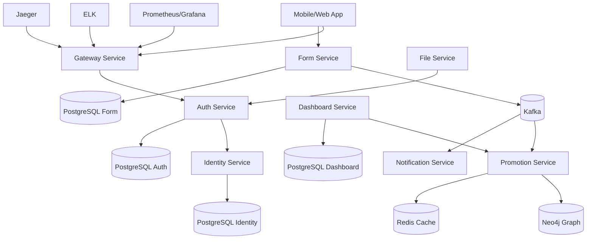

# Arquitectura de CircleGuard

## Decisiones clave

- Microservicios Spring Boot separados por dominio.
- Persistencia poliglota: PostgreSQL para datos transaccionales, Neo4j para contactos, Redis para cache.
- Comunicacion asincrona con Kafka para eventos de formularios, promociones y notificaciones.
- Kubernetes como plataforma comun para dev/stage/prod.
- Terraform para declarar namespaces, deployments y observabilidad.
