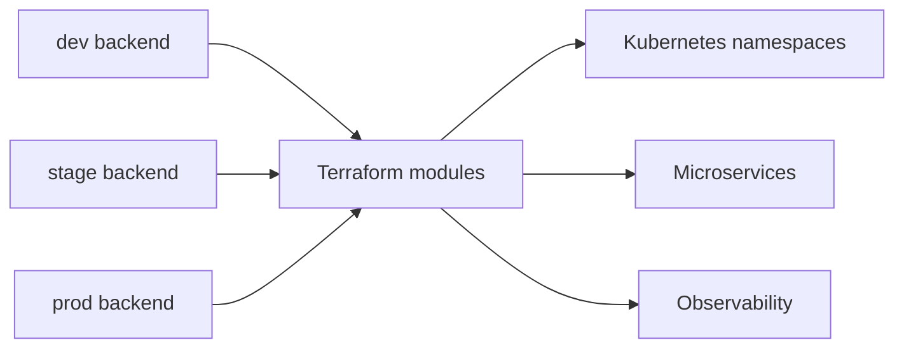

# Terraform Infrastructure as Code

This folder defines CircleGuard infrastructure using modular Terraform.

- `modules/namespace`: namespace factory.
- `modules/microservice`: deployment, service, probes and environment configuration.
- `modules/observability`: monitoring bootstrap resources.
- `envs/dev`, `envs/stage`, `envs/prod`: isolated remote state and scaling policies.

Remote state is declared with S3 + DynamoDB locking placeholders.

